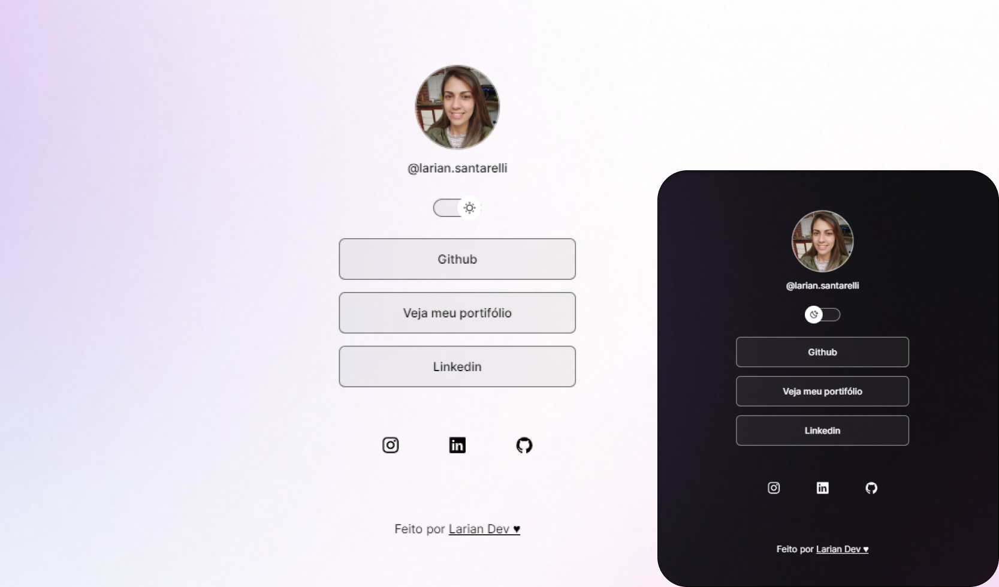

# Pagina pessoal com links interessantes
<h1 align="center"> Página de Links </h1></h1>

Página pessoal responsiva para exibir e divulgar links interessantes ao seu público

 
 

## Tecnologias
Usei as seguintes tecnologias no meu projeto:
- HTML e CSS
- Javascript
- Git e Github
- Figma

## License

This project is under MIT license. See the file [LICENSE](.github/LICENSE.md) for more details.

---

Made with ♥ by Mayk Brito 
